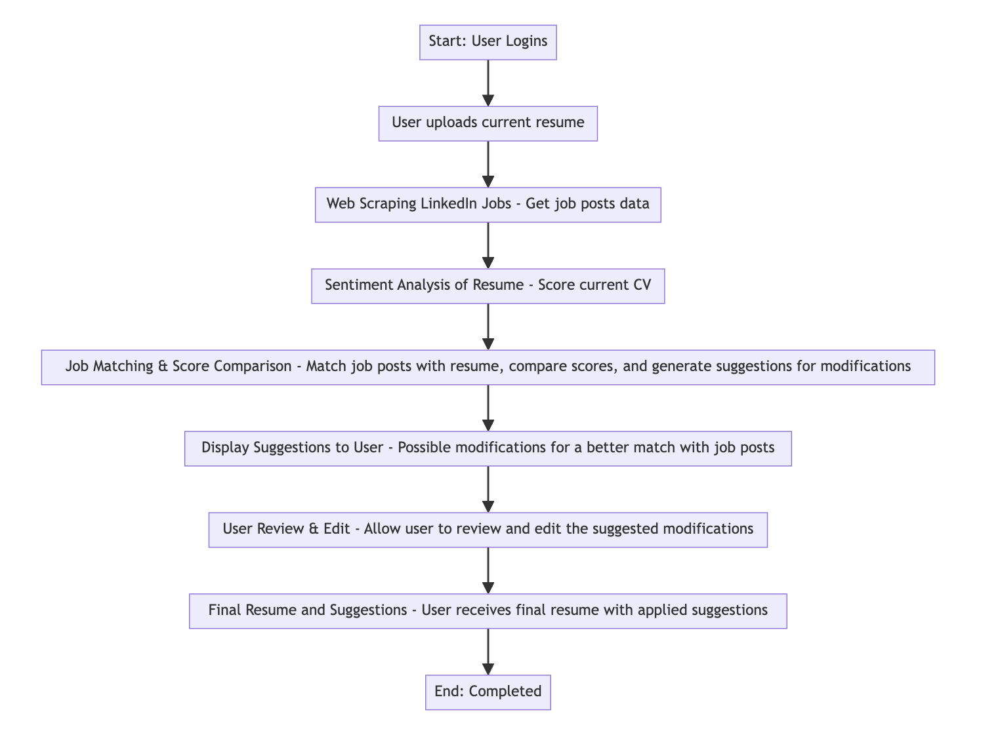

# Project Title
SkillSync

## Overview

SkillSync is a groundbreaking platform designed to revolutionize the way you manage your resume and navigate your career path. Harnessing the power of automation, SkillSync dynamically updates your CV in real-time, aligning it seamlessly with the requirements of specific job posts

### Problem

As a working professional who has experienced the nuances of job hunting, I understand the tedious and time-consuming nature of tailoring a resume to match specific job posts. The process often involves manual adjustments, requiring a meticulous review of job requirements and the careful alignment of skills and experiences. However, the reality is, like many individuals, I find the task of consistently updating and customizing my Resume to be cumbersome task. SkillSync is the best automated solution for stated problem.

### User Profile

SkillSync is designed to cater to a diverse audience of job seekers, and individuals aiming to enhance their career prospects

### Features

As a job seeker, I want to use an automated resume checker to improve my resume's match with LinkedIn job posts, receive sentiment analysis insights, and get suggestions for modifications to increase my chances of landing relevant job opportunities.

1. User login
2. Uploading Resume
3. Extract LinkdIn or Indeed job posts
4. Sentiment Analysis
5. Job Matching
6. Suggestions for Modifications
7. Download resume as a pdf

## Implementation

### Tech Stack

1. React JS
2. Node Js
3. axios
4. Express Js
5. Knex Js
6. Sentiment
7. Puppeteer
8. sass

### APIs

OpenAI, LinkdIn API

### Sitemap

1. Login Page
2. Landing Page
3. User Profile Page 

### Mockups

--

### Data

One-to-Many with Resumes (a user can upload multiple resumes) 
Many-to-Many with Resumes (multiple resumes can match with a job post, and a resume can match with multiple job posts)

### Endpoints
ex:

### Auth

JSON Web Token (JWT) authentication

## Roadmap

1. setup the project and complete user login
2. Resume upload
3. Do the analysis 
4. Modifications/suggestions
5. Final version 

## Nice-to-haves

1. Membership and payment gateway 

